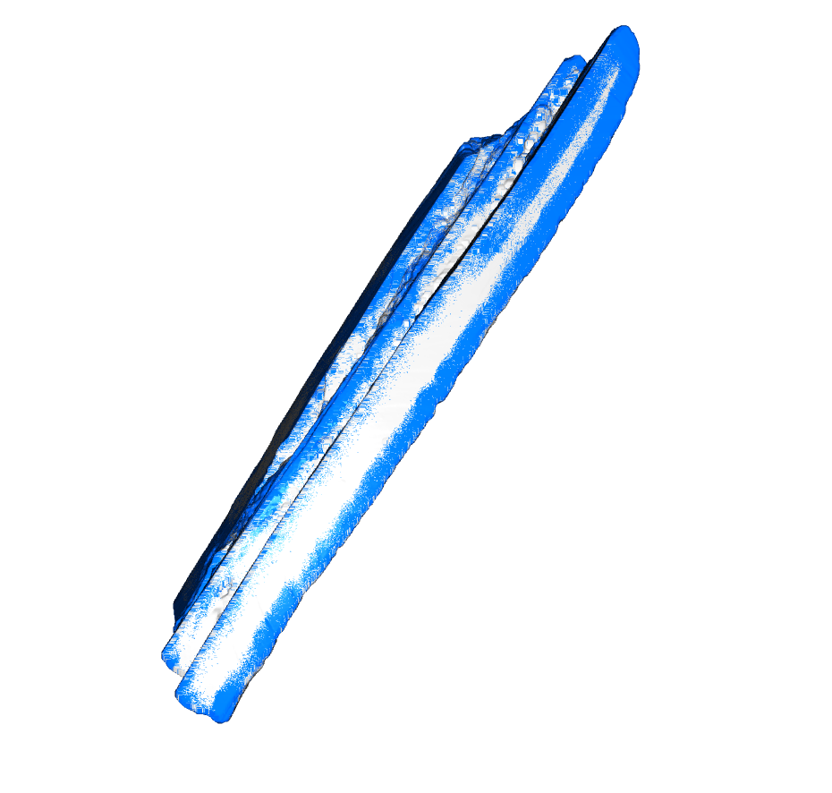
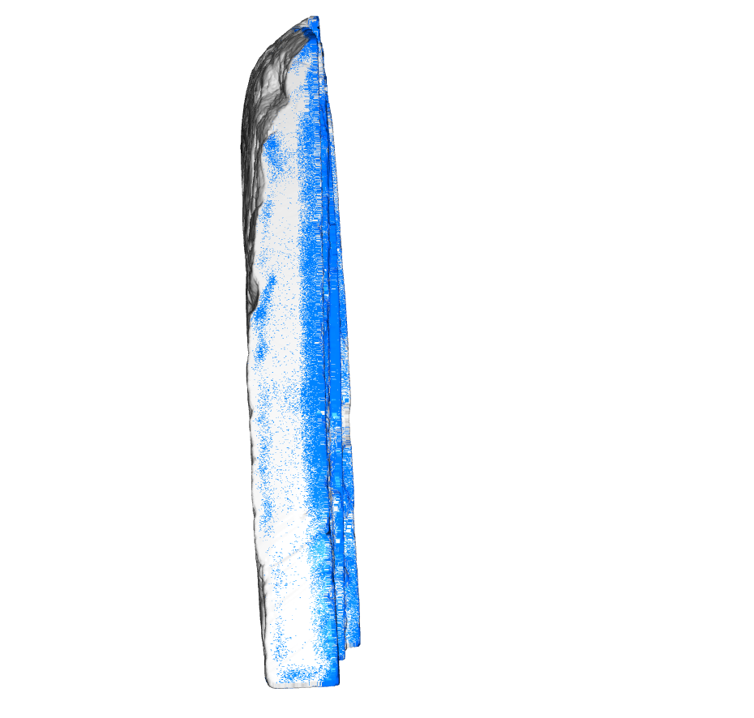

# Break Surface Detection on 3D Archaeological Stone Fragments

Automatic detection of break surfaces on 3D point cloud scans of stone fragments using PointNet++.  
Part of the **Healing Stones** project — reconstructing fragmented cultural heritage artifacts with AI.

---

## What It Does

Given a 3D scan of a stone fragment (`.ply` file), the model classifies every point as either:
- **Break surface** — where the stone fractured (shown in blue)
- **Original surface** — the weathered exterior (shown in grey)

This is the first step toward automated fragment reassembly.

---

## Project Structure

```
.
├── predict.py          # Run break surface detection (start here)
├── train.py            # Train the model on new GT fragments
├── preprocess.py       # Point cloud preprocessing (dedup, voxel, normals)
├── config.py           # All paths and hyperparameters
├── model/
│   ├── pointnet2.py    # PointNet++ architecture
│   └── dataset.py      # Dataset and data loading
├── data/
│   ├── without_gt/     # <-- DROP YOUR PLY FILES HERE for prediction
│   └── with_gt/        # GT-labelled fragments for training
├── checkpoints/
│   └── best_model.pt   # Pretrained model weights
└── results/            # Output PLY files saved here
```

---

## Quickstart

### 1. Install dependencies

```bash
pip install torch torchvision open3d numpy scikit-learn
```

### 2. Download pretrained model

Place `best_model.pt` in the `checkpoints/` directory.  
Download: [Google Drive link]

### 3. Run prediction

```bash
# Default — runs on all files in data/without_gt/
python3 predict.py

# Single file
python3 predict.py path/to/fragment.ply

# Folder of fragments
python3 predict.py path/to/folder/
```

Results are saved to `results/`:
- `<fragment>_raw.ply` — raw model output (threshold only)
- `<fragment>_postprocessed.ply` — after iterative fill + noise removal
- `<fragment>_predictions.npz` — probability arrays for further processing

---

## Pipeline

```
Input PLY file
      |
      v
Preprocessing
  - Deduplication
  - Voxel downsample (0.5mm)
  - Statistical outlier removal
  - Normal estimation
      |
      v
PointNet++ Inference
  - For each point: extract 4096-point local neighbourhood
  - Hierarchical feature learning: 4096 -> 1024 -> 256 -> 64 -> global
  - Output: break probability per point
      |
      v
Post-processing
  - Threshold (default 0.5)
  - Probability pull-in (borderline points near high-confidence break regions)
  - Iterative fill (3 passes: recovers interior break points)
  - Erosion (removes isolated false positives)
  - DBSCAN cluster removal (removes small noise clusters)
      |
      v
Coloured PLY output
  Blue  = break surface
  Grey  = original surface
```

---

## Model

**Architecture:** PointNet++ (Set Abstraction layers + Global Aggregation + MLP classifier)  
**Input:** XYZ coordinates + surface normals (6 channels) per local patch of 4096 points  
**Output:** Binary classification — break (1) or original (0) per point  
**Parameters:** 1,797,634  

| Model | Val F1 | Precision | Recall | Rotation Invariant |
|-------|--------|-----------|--------|--------------------|
| Random Forest (with normals) | 0.744 | 0.616 | 0.940 | No |
| Random Forest (without normals) | 0.592 | 0.504 | 0.716 | Yes |
| **PointNet++ (ours)** | **0.957** | **0.936** | **0.980** | **Yes** |

The model is fully rotation-invariant — fragments scanned at any orientation are handled correctly.

---

## Results — frag3 (Unseen Fragment)

The images below show prediction results on **frag3**, a fragment the model had never seen during training, scanned at a different orientation from the training fragments. Blue = predicted break surface, grey = predicted original surface.

**Front face** — carved original surface correctly identified as grey; break edges correctly detected in blue:


**Side view** — clean detection of the flat fracture face:


**Break face close-up** — break surface contiguously detected across the slab edge:



**Edge-on view** — break edge correctly identified; some scatter on the flat face visible (addressed by post-processing):



The model generalizes well to unseen fragments at arbitrary orientations, confirming rotation invariance.

---

## Training on New Data

To train on your own GT-labelled fragments:

1. Export fragments from Blender with break surfaces painted **green** (RGB: 0, 255, 0)
2. Place PLY files in `data/with_gt/`
3. Run:

```bash
python3 train.py
python3 train.py --epochs 100 --batch_size 32
```

Ground truth is extracted automatically from green vertex colours.

---

## Optional Flags

```bash
python3 predict.py --help

  path            Path to .ply file or folder (default: data/without_gt/)
  --checkpoint    Model checkpoint path       (default: checkpoints/best_model.pt)
  --threshold     Break probability cutoff    (default: 0.5)
  --batch_size    Patches per GPU per step    (default: 64)
  --voxel         Voxel downsample size       (default: 0.5)
```

---

## Hardware

- Runs on CPU (slow) or any CUDA GPU
- Multi-GPU supported automatically via DataParallel
- Tested on 3x NVIDIA RTX A4000 (16GB each)
- ~30-60 min per fragment on a single GPU depending on point count

---

## References

- [PointNet++: Deep Hierarchical Feature Learning on Point Sets in a Metric Space](https://arxiv.org/abs/1706.05350) — Qi et al., 2017
- [Open3D](http://www.open3d.org/) — point cloud processing
- Healing Stones project — University of Alabama / ML4Sci / GSoC 2025
